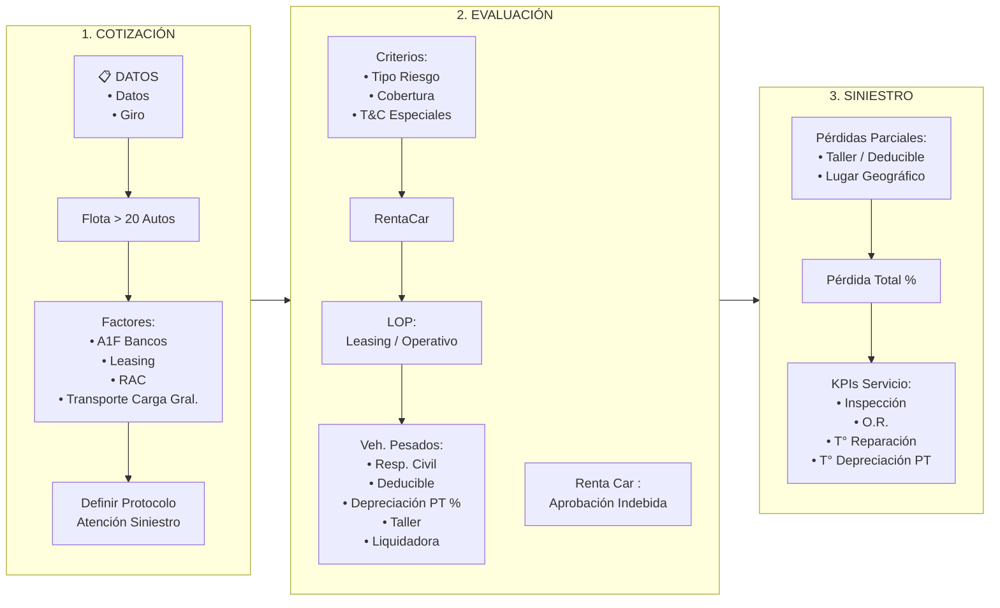

# Siniestro-BCI

## Flujo de Cotización y Siniestros - Flotas

```mermaid
flowchart LR
    subgraph COTIZACION["1. COTIZACIÓN"]
        direction TB
        DATOS["📋 DATOS<br/>• Datos<br/>• Giro"]
        REQUISITO["Flota > 20 Autos"]
        FACTORES["Factores:<br/>• A1F Bancos<br/>• Leasing<br/>• RAC<br/>• Transporte Carga Gral."]
        PROTOCOLO["Definir Protocolo<br/>Atención Siniestro"]
        
        DATOS --> REQUISITO
        REQUISITO --> FACTORES
        FACTORES --> PROTOCOLO
    end
    
    subgraph EVALUACION["2. EVALUACIÓN"]
        direction TB
        CRITERIOS["Criterios:<br/>• Tipo Riesgo<br/>• Cobertura<br/>• T&C Especiales"]
        DAC["Renta Car :<br/>Aprobación Indebida"]
        LOP["LOP:<br/>Leasing / Operativo"]
        PESADOS["Veh. Pesados:<br/>• Resp. Civil<br/>• Deducible<br/>• Depreciación PT %<br/>• Taller<br/>• Liquidadora"]
        
        CRITERIOS --> RentaCar
        RentaCar --> LOP
        LOP --> PESADOS
    end
    
    subgraph SINIESTRO["3. SINIESTRO"]
        direction TB
        PARCIALES["Pérdidas Parciales:<br/>• Taller / Deducible<br/>• Lugar Geográfico"]
        TOTAL["Pérdida Total %"]
        KPIS["KPIs Servicio:<br/>• Inspección<br/>• O.R.<br/>• T° Reparación<br/>• T° Depreciación PT"]
        
        PARCIALES --> TOTAL
        TOTAL --> KPIS
    end
    
    COTIZACION --> EVALUACION
    EVALUACION --> SINIESTRO
```
